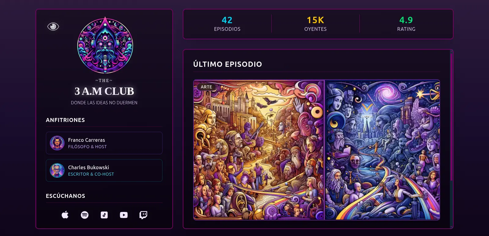

# 🌌 The 3a.m Club

Un sitio web experimental para un **podcast ficticio** llamado *The 3a.m Club*, inspirado en la estética psicodélica de *The Midnight Gospel*.  
Construido con **Astro**, **React**, **TailwindCSS** y **Zustand**, este proyecto combina **contenido dinámico** (episodios en Markdown) con una **experiencia inmersiva** y un **reproductor interactivo**.

---

## ✨ Características

- 🎨 **Diseño psicodélico** con **TailwindCSS**.
- 🧩 **Arquitectura híbrida**: Astro + React.
- 🗂 **Episodios en Markdown** (fáciles de gestionar y escalar).
- 🎧 **Reproductor de podcast interactivo** integrado con React.
- 🧠 **Gestión global del estado** con Zustand.
- ⚡ **Optimización y rendimiento** con la arquitectura de Astro.

---

## 🛠️ Tecnologías utilizadas


---

## 📂 Estructura del proyecto

```
the-3am-club/
│
├── public/             # Archivos estáticos (imágenes, favicon)
├── src/
│   ├── components/     # Componentes React y Astro
│   ├── layouts/        # Plantillas base
│   ├── pages/          # Rutas del proyecto
│   ├── store/          # Estado global (Zustand)
│   └── podcasts/       # Episodios en formato Markdown
│
├── astro.config.mjs    # Configuración de Astro
├── tailwind.config.js  # Configuración de TailwindCSS
└── package.json
```

---

## 🚀 Instalación y uso

1. **Clona este repositorio**:
   ```bash
   git clone https://github.com/Fr4nco77/the-3am-club.git
   ```
2. **Accede al directorio**:
   ```bash
   cd the-3am-club
   ```
3. **Instala las dependencias**:
   ```bash
   pnpm install
   ```
4. **Ejecuta el servidor de desarrollo**:
   ```bash
   pnpm dev
   ```
5. **Abre en tu navegador**:
   ```
   http://localhost:4321
   ```

---

## ➕ Cómo agregar nuevos episodios

1. Ve a la carpeta:
   ```
   /src/podcasts/
   ```
2. Crea un archivo `.md` con este formato:
   ```markdown
   ---
   title: "Título del episodio"
   date: "2025-08-22"
   audio: "/assets/audio/episodio.mp3"
   description: "Descripción breve del episodio."
   ---
   Contenido adicional del episodio.
   ```
3. Guarda el archivo y se generará automáticamente en el sitio.

---

## 🖼️ Vista previa



---

## 🌱 Inspiración

Este proyecto es un homenaje a la estética vibrante y filosófica de **The Midnight Gospel**, trasladada a la web con herramientas modernas para crear una experiencia inmersiva y fluida.

---

## 📜 Licencia

Este proyecto está bajo la licencia **MIT**.  
Creador: **Franco**.
