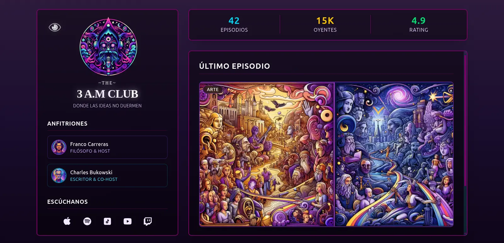

# 🌌 The 3a.m Club

Un sitio web experimental para un **podcast ficticio** llamado *The 3a.m Club*, inspirado en la estética psicodélica de *The Midnight Gospel*.  
Construido con **Astro**, **React**, **TailwindCSS** y **Zustand**, este proyecto combina **contenido dinámico** (episodios en Markdown) con una **experiencia inmersiva** y un **reproductor interactivo**.


## ✨ Características

- 🎨 **Diseño psicodélico** con **TailwindCSS**.
- 🧩 **Arquitectura híbrida**: Astro + React.
- 🗂 **Episodios en Markdown** (fáciles de gestionar y escalar).
- 🎧 **Reproductor de podcast interactivo** integrado con React.
- 🧠 **Gestión global del estado** con Zustand.
- ⚡ **Optimización y rendimiento** con la arquitectura de Astro.


## 🛠️ Tecnologías utilizadas


## 📂 Estructura del proyecto
```
the-3am-club/
│
├── public/             # Archivos estáticos (favicon, robots.txt)
├── src/
│   ├── actions/        # Astro Actions (server actions y lógica de servidor)
│   ├── assets/         # Recursos estáticos procesados (imágenes, fuentes estilos)
│   ├── components/     # Componentes React y Astro
│   ├── contact/        # Modulo de mensajería (proveedores y lógica de envio)
│   ├── layouts/        # Plantillas base
│   ├── pages/          # Rutas del proyecto
│   ├── store/          # Estado global (Zustand)
│   ├── utils/          # Funciones auxiliares y helpers (toasts, formateadores)
│   └── podcasts/       # Episodios en formato Markdown
│
├── .env.example        # Plantilla con las variables de entorno necesarias
├── astro.config.mjs    # Configuración de Astro
├── tailwind.config.js  # Configuración de TailwindCSS
└── package.json
```

## 🚀 Instalación y uso

1. **Clona este repositorio**:
   ```bash
   git clone https://github.com/Fr4nco77/the-3am-club.git
   ```
2. **Accede al directorio**:
   ```bash
   cd the-3am-club
   ```
3. **Instala las dependencias**:
   ```bash
   pnpm install
   ```
4. **Ejecuta el servidor de desarrollo**:
   ```bash
   pnpm dev
   ```
5. **Abre en tu navegador**:
   ```
   http://localhost:4321
   ```

## 📬 Módulo de Mensajería Modular

El proyecto cuenta con un sistema de contacto desacoplado basado en el patrón **Strategy/Factory**, lo que permite cambiar o añadir proveedores de envío (Telegram, Resend, Discord, etc.) sin modificar la interfaz de usuario ni la Server Action de Astro.

### ✨ Características Clave

* **Arquitectura Desacoplada:** Separa completamente la UI (`contact.astro`) y la lógica del servidor de la capa de envío (`/src/contact`).
* **Configuración Centralizada:** El cliente activo se define en un único archivo de configuración (`providers.ts`), sin necesidad de alterar scripts en las vistas.
* **Extensibilidad Sencilla:** Integra nuevos canales creando una clase que implemente la interfaz del módulo sin alterar el resto de la aplicación.
* **Tipado Estricto (TypeScript & Zod):** Validación de datos de entrada en el servidor mediante Zod y contratos de respuesta estrictamente tipados.
* **Seguridad y Feedback UI:** Manejo de variables de entorno en el servidor y notificaciones dinámicas (*toasts*) para estados de carga, éxito o error.

---

### ⚙️ Configuración y Uso

#### 1. Seleccionar el Proveedor Activo
Abre `src/contact/providers.ts` y asigna el proveedor deseado en la constante `currentProvider`:

```typescript
// src/contact/providers.ts
export const PROVIDERS = ["telegram"] as const;
export type Provider = (typeof PROVIDERS)[number];

// Asigna el proveedor activo o deja "" para modo local
export const currentProvider: Provider | "" = "telegram";
```

#### 2. Cómo Agregar un Nuevo Proveedor
##### 1. Añadir el identificador a los tipos:
```TypeScript
// src/contact/providers.ts
export const PROVIDERS = ["telegram", "resend"] as const;
```

##### 2. Crear la clase con la lógica de envío:
``` TypeScript
// src/contact/resend.ts
import type { ContactInput, SendResult, ContactSender } from "./types";

export default class ResendSender implements ContactSender {
provider = "resend";

async send(input: ContactInput): Promise<SendResult> {
   // Lógica de consumo de la API
   return { success: true, info: "Mensaje enviado" };
}
}
```

##### 3. Vincular el proveedor al registro:

``` TypeScript
// src/contact/index.ts
import ResendSender from "./resend";

export const registry: Record<Provider, ContactSender> = {
telegram: new TelegramSender(),
resend: new ResendSender(), // Registrar nueva instancia
};
```

##### 4. Configurar Variables de Entorno:
Agrega las variables necesarias para el nuevo servicio en tu .env local.

## ➕ Cómo agregar nuevos episodios

1. Ve a la carpeta:
   ```
   /src/podcasts/
   ```
2. Crea un archivo `.md` con este formato:
   ```markdown
   ---
   title: "Título del episodio"
   date: "2025-08-22"
   audio: "/assets/audio/episodio.mp3"
   description: "Descripción breve del episodio."
   ---
   Contenido adicional del episodio.
   ```
3. Guarda el archivo y se generará automáticamente en el sitio.


## 🖼️ Vista previa




## 🌱 Inspiración

Este proyecto es un homenaje a la estética vibrante y filosófica de **The Midnight Gospel**, trasladada a la web con herramientas modernas para crear una experiencia inmersiva y fluida.


## 📜 Licencia

Este proyecto está bajo la licencia **MIT**.  
Creador: **Franco**.
